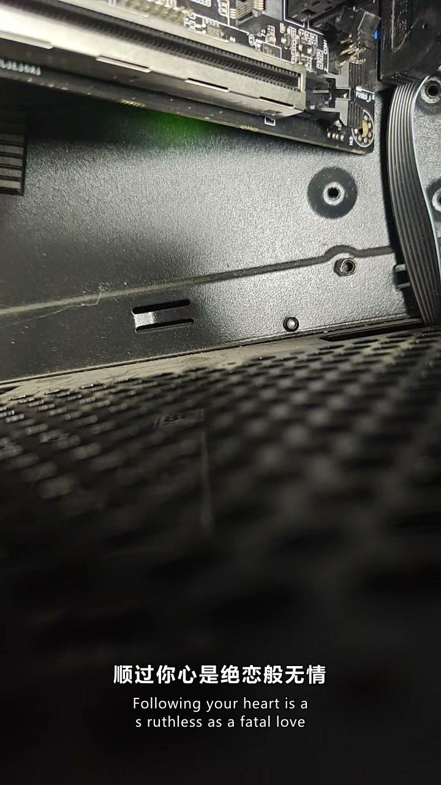

# 阶段 4-B 验收报告 —— 文案生成与双语字幕

> 日期：2026-09-26
> 范围：TASKS.md 阶段 4 的 **F9（标题/简介）** 与 **F14（字幕翻译）**
> 产出：`sliceq/translate.py`、`sliceq/copywriter.py`、`ui/pages/copy_dialog.py`、
> 导出对话框双语区、`prompts.py` 增补
> 自测：`selftest_translate.py`（66 项）
> 端到端：`selftest_bilingual_e2e.py`（17 项，真实素材 + 真实 API）
> 前置实测：`probe_translate_sources.py` / `probe_llm_translate.py`
> 状态：✅ 本阶段完成；阶段 4 仅剩 F15 并发与 F16 外部联动

---

## 1. 结论速查

| # | 问题 | 结论 |
|---|---|---|
| 1 | 免费翻译通道还能用吗 | ❌ **基本全灭**：Google 被墙、必应 401、LibreTranslate 403 |
| 2 | 唯一可用的 MyMemory 质量如何 | ❌ **撑不起交付**：「在床路崎岖中流浪」→「wandering in the rugged bed road」|
| 3 | 那双语字幕怎么办 | ✅ **只走 LLM 精翻**，成本实测低到可忽略 |
| 4 | 译文错位风险怎么防 | ✅ 条数硬校验 + 逐条降级（见 §4）|
| 5 | 双语渲染链路要改吗 | ✅ **不用改** —— 阶段 3 的 `to_ass` 已支持主/副两层 |

---

## 2. 前置实测：原设计的"免费通道"假设被推翻

TECH-DESIGN §4.5 原写：`翻译-免费 | 必应/谷歌网页接口封装，零成本，质量够用`。

实测（`probe_translate_sources.py`）：

| 通道 | 结果 | 详情 |
|---|---|---|
| Google `translate_a/single` | ❌ | `translate.googleapis.com` / `translate.google.com` **双双 ReadTimeout**（被墙）|
| 必应 `ttranslatev3` | ❌ | **HTTP 401 `{"ShowCaptcha":false}`** |
| 必应（带 IG/IID/AbuseParams） | ❌ | 同样 401 —— 页面能取到 token，接口仍拒绝非浏览器会话 |
| LibreTranslate × 3 个公共实例 | ❌ | 全 403 / SSL 失败 |
| **MyMemory** | ✅ 通 | 1670ms，但质量不可用 |
| 基线对照（必应首页 / GitHub） | ✅ 通 | 说明不是"整个网不通" |

> 必应那一条值得留意：**页面能正常打开、`IG`/`IID`/`params_AbusePreventionHelper`
> 都能正则取到、token 也带上了，接口依然 401。**
> 这类"看起来步骤都对但被拒"的情况，不要继续猜参数 ——
> 它是在服务端做会话/指纹校验，客户端绕不过去。

然后测 LLM 精翻（`probe_llm_translate.py`，用真实直播字幕）：

| 方式 | 时间 | 费用 | 单字成本 |
|---|---|---|---|
| MyMemory（免费） | 1.7s | ¥0 | — |
| LLM 直翻 | 3.9s | ¥0.00066 | ¥0.0000026 |
| LLM 反思式精翻 | 3.3s | ¥0.00080 | ¥0.0000031 |

**20 条 255 字只需 ¥0.0008**（外推 1 分钟字幕 ≈ ¥0.0008）。

### 架构决策

原设计是「免费初翻 + LLM 反思审校」—— 但前提是"免费初翻质量够用"。
实测这个前提**不成立**。免费初翻不但省不下钱（LLM 本身就便宜到可忽略），
**还会把错误引给 LLM**（对照一份本来就错的初稿审校，比从原文直接翻更容易走偏）。

⇒ v1 **只走 LLM 精翻**。MyMemory 保留为"完全没配 key 时的兜底"，
且调用方必须把"机翻质量"这件事告诉用户（TECH-DESIGN §4.5 已改）。

---

## 3. 交付物

| 文件 | 内容 |
|---|---|
| `sliceq/translate.py` | 分批翻译、条数硬校验、逐条降级、MyMemory 兜底、`apply_to_cues` |
| `sliceq/copywriter.py` | 3 条候选标题 + 1 段简介，逐条失败隔离，可复制文本拼装 |
| `sliceq/ui/pages/copy_dialog.py` | 文案对话框（进度 / 结果 / 一键复制 / 费用提示）|
| `sliceq/ui/pages/export_dialog.py` | 新增「双语字幕」区（开关 + 目标语言 + 费用与前置条件说明）|
| `sliceq/prompts.py` | 翻译（精翻/直翻）、文案提示词；含"为什么不用免费通道"的实测记录 |
| `sliceq/subtitle.py` | `build_for_clip` 接入翻译（**在 remap 之后翻**）|
| `sliceq/editor.py` | 透传翻译参数；`translated` / `cost_cny` 记进每条结果 |

**双语渲染不用改代码**：阶段 3 的 `to_ass()` 早就接受
`(start, end, main, sub)` 四元组并分别渲染 `Main` / `Sub` 两层样式，
`to_srt(bilingual=True)` 也早就支持。本阶段只是**把译文填进 `cue.sub`**。

---

## 4. ★ 本阶段最大的风险：静默错位

字幕是按行对应画面的。模型**少输出一行**，从那一行开始
**所有字幕都会与画面错开**，而且不产生任何报错。

### 4.1 三层防线

| 层 | 做法 |
|---|---|
| ① 提示词 | 显式编号 + 强调"输入几行就输出几行"（实测不写编号时模型会自行合并句子，20 条变 17 条）|
| ② 解析校验 | 条数必须 == 期望，否则返回 `None`（**不做任何"尽力对齐"**）|
| ③ 降级链 | 重试一次 → 仍不符则**拆成单条逐条翻译**（单条不可能错位）→ 单条也失败则该条**保留原文** |

**保留原文而不是丢弃**是关键：丢掉会让后面的行整体前移，那正是我们要避免的错位。

### 4.2 抓到的缺陷：越界编号被静默丢弃

自测里"条数多一行 → 必须返回 None"这条**一开始是 FAIL**。

原因：解析器为了容忍"多出来的说明行"，会把编号 > 期望值的行**直接过滤掉**。
于是 `1. a / 2. b / 3. c`（期望 2 条）会返回 `[a, b]`，看上去完美。

**但这个"过滤"正好把错位伪装成了正常** ——
多出来的那一行到底是噪声，还是模型**把两条拆成了三条**，从文本上看不出来。

修法：编号超出 `1..expect` 范围**一律判失败**，交给重试/逐条降级去解决。

> 这是本项目第 N 次遇到同一类问题：**容错逻辑本身制造了"看起来对"的假象。**
> 判断标准是——这个容错是否**掩盖了不可区分的情况**。是，就不能容。

### 4.3 自测覆盖的畸形输入

`parse_numbered` 的 14 种情况：标准编号 / 中文标点编号 `1、` / 圆括号 `1)` /
代码块围栏（带不带语言标记）/ 编号乱序 / 混入说明行 / **少一行** / **多一行** /
**跳号** / 编号重复 / 无编号但行数对 / 全空 / 纯文本行。

翻译流程的 mock 注入：

| 场景 | 断言 |
|---|---|
| 模型少输出一行 | 触发重试 → 逐条降级 → **条数仍一一对应** |
| 永远返回空 | 条数不变、原样保留原文、失败计数正确 |
| 分批（5 条 / 每批 2）| 3 批完成，**跨批结果顺序正确** |
| 输入含空行 | 空行不送模型（省 token），但**位置保持** |
| 无 transport | 不静默吞掉，给出可读原因 |

---

## 5. 验证证据链

### 5.1 自测与回归（累计 256 项，全绿）

| 脚本 | 项数 | 结果 |
|---|---|---|
| `selftest_translate.py` | 66 | **66 / 66** |
| `selftest_bilingual_e2e.py` | 17 | **17 / 17** |
| `selftest_export_enhance_gui.py` | 39 | **39 / 39** |
| `selftest_enhance.py` | 70 | 70 / 70（无回归）|
| `selftest_enhance_real_e2e.py` | 22 | 22 / 22（无回归）|
| `selftest_editor.py` | 23 | 23 / 23（无回归）|
| `selftest_export_chain.py` | 19 | 19 / 19（无回归）|

### 5.2 真实素材端到端（`selftest_bilingual_e2e.py`）

素材：`[未明子]2026年09月25日00时录播.mp4`，取 348.8s~391.3s 共 **8 条真实字幕**

| 项 | 结果 |
|---|---|
| 字幕条数 | 8 |
| **拿到译文的条数** | **8（与字幕条数一致）** |
| SRT 块数 | 8，且 **8/8 都是双行** |
| ASS Dialogue 数 | 单语 8 / 双语 **16**（≈ ×2）|
| 成片时长 | 42.6s（设定 42.52s）|
| 翻译费用 | **¥0.000570** |

译文样例：

```
什么问题都我想慢慢解决。  →  I want to take it slow with every problem.
顺过你心是绝恋般无情      →  Your heart is cold, like a loveless fate.
```

### 5.3 成片人工确认



从成片里抽的一帧：**中文原文在上、英文译文在下，两行都正常渲染**。
（配色为亮绿，来自设计稿配色 —— 见 §7.1。）

---

## 6. 本轮抓到的缺陷

| # | 缺陷 | 性质 | 修法 |
|---|---|---|---|
| 1 | **解析器静默丢弃越界编号** | 产品缺陷 —— 容错掩盖了"拆句"与"噪声"这两种不可区分的情况 | 编号越界即判失败（§4.2）|
| 2 | `usage.cost_cny` 当成方法调用 | **我的脚本 bug**（它是 `@property`），被 `except` 吞成"调用失败" | 去掉括号 |
| 3 | 双语测试漏传 `translate_transport` | **我的测试 bug** ——看起来像"双语 ASS 没生成 Sub 行"，实际是测试自己没给翻译通道 | 补参数，并在产品 docstring 里写明两个 transport 的区分 |
| 4 | 阶段 3 异常测试残留了两个垃圾预设（`损坏测试` / `类型错误`）| 环境残留，会出现在用户的预设下拉里 | 已删除（`styles/` 目录现只剩 `default`）|

> 第 1 条和第 3 条的共同点：**测试失败时，先分清是"产品坏了"还是"测试写错了"。**
> 这一轮 4 个缺陷里有 2 个是测试自己的错 —— 如果直接照第一版结论去改产品，
> 会改坏一个本来正常的地方（阶段 4-A 已经栽过一次同类）。

---

## 7. 已知局限 / 待办

### 7.1 需要用户确认

- **字幕默认配色是亮绿 `#00FF00`**（代码注释标明"设计稿配色"）。
  它在成片里可读性一般，行业惯例是白字黑边。**这是刻意的还是沿用了设计稿？**
  改一处常量即可（`subtitle_style.DEFAULT_COLOR`）。
- **批量 BGM 目录仍为空**（阶段 4-A 遗留）—— 需要用户提供音乐或确认接受零内置。

### 7.2 未做

| 项 | 说明 |
|---|---|
| F15 批量并发 | 任务队列、并发度可配 |
| F16 VideoCaptioner 联动 | **开工前需重新论证检测方式**（官方是 Windows 安装包，`where`/`pip show` 均不命中）|
| 翻译的"术语一致性" | 跨批次翻译时，同一个专有名词可能被译成不同写法。当前不做术语表；如果用户反映，再加"术语对照表"注入提示词 |
| 翻译质量的人工评估 | 本次只做了抽样判读（译文自然、无明显错译），**没有系统的人工评分**。样本里混有歌词，不能代表全部语料 |
| 双语字幕的样式预设 | 主/副样式在「字幕样式」页可分别调，但没有"双语专用预设"一键切换 |

### 7.3 一个观察

真实素材的字幕里混着**直播时播放的歌词**（"我宁愿看着你,谁得如此沉浸"）。
这类内容翻译起来天然吃力（且对切片无意义）。
**候选片段选取本身就包含歌词段**，而精析评分并未因此降权 ——
是否该让精析对"疑似歌词/无关内容"给更低分，值得后续讨论。

---

## 8. 交接提示

下一位接手时，先看这三条：

1. **不要试图接回免费翻译接口。** 实测目录保存在 `probe_translate_sources.py`，
   连"带 token 的必应"都是 401。想省成本的话，方向是**减少翻译条数**（比如只翻片段内），
   而不是换接口。
2. **动翻译相关代码时，先跑 `selftest_translate.py`。**
   它专门测"模型输出畸形时会不会静默错位"，这是本模块唯一的高危点。
3. **`subtitle.build_for_clip` 有两个 transport 参数**（`transport` 断句 /
   `translate_transport` 翻译），传错不会报错，只会"没有译文"。
